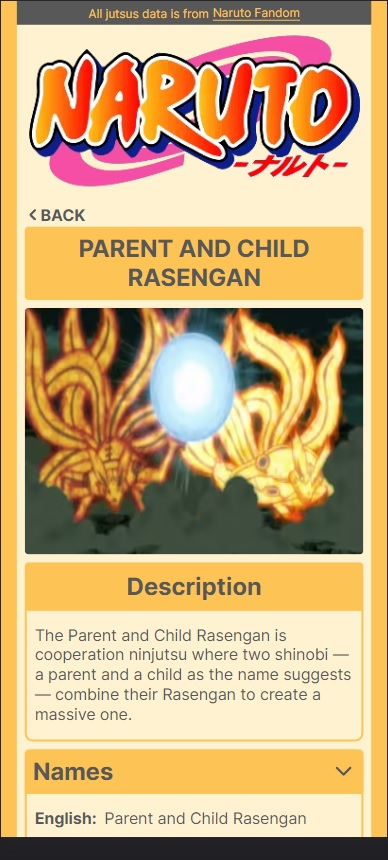

# Naruto Jutsus

## Description

Naruto Jutsus is a web app that lists the jutsus of Naruto anime. All jutsus data is from [Naruto Fandom](https://naruto.fandom.com/wiki/Category:Jutsu).

## Technologies used

- next
- react
- react query
- redux
- styled-components

## Images

## Getting started

#### Clone this repository

`git clone https://github.com/gustavool/naruto-jutsus-client.git`

#### Install dependencies

inside the main folder execute: `npm install`

#### Run project

`npm run dev`
